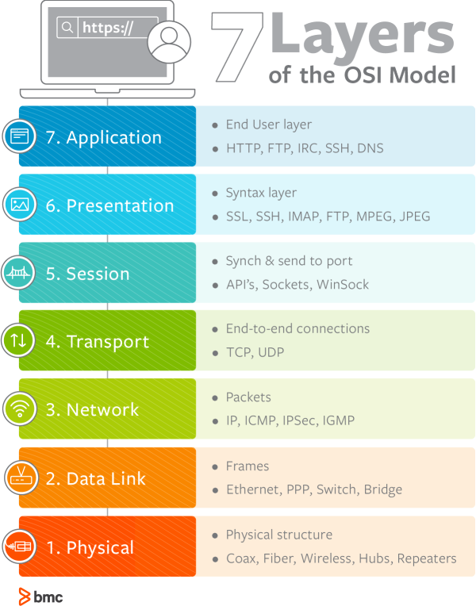

# OSI 7 계층

    

## OSI 7 계층이란?

- 네트워크 프로토콜이 통신하는 구조를 7개의 계층으로 분리하여 각 계층간 상호 작동하는 방식을 정해 놓은 것
- ISO(국제표준화기구)에서 개발한 모델
- 네트워크 구성을 예측하고 이해할 수 있음
- 네트워크에서 트래픽의 흐름을 꿰뚫어 볼 수 있으며, 각 계층은 독립되어 있다. 7단계 중 특정한 곳에 이상이 생기면 다른 단계의 장비 및 소프트웨어를 건드리지 않고도 이상이 생긴 단계만 고칠 수 있음
- 하위층 : 1-4 / 상위층 : 5-7

## 물리 계층

- 네트워크의 기본 네트워크 하드웨어 전송 기술
- 네트워크의 높은 수준의 기능의 논리 데이터 구조를 기초로 하는 필수 계층
- PDU : 비트(Bit)

## 데이터 링크 계층

- 네트워크 위의 개체들 간 데이터를 전달하고, 물리 계층에서 발생할 수 있는 오류를 찾아 내고, 수정하는 데 필요한 기능적, 절차적 수단을 제공
- 포인트 투 포인트(Point to Point) 간 신뢰성있는 전송을 보장하기 위한 계층
- 에러검출/재전송/흐름제어
- MAC 주소를 통해 통신
- PDU : 프레임(Frame)

## 네트워크 계층

- 여러개의 노드를 거칠때마다 경로를 찾아주는 역할을 하는 계층
- 라우팅, 흐름 제어, 세그멘테이션(segmentation/desegmentation), 오류 제어, 인터네트워킹(Internetworking) 등을 수행
- 라우터가 이 계층에서 동작하고 이 계층에서 동작하는 스위치도 있음
- 데이터를 연결하는 다른 네트워크를 통해 전달함으로써 인터넷이 가능하게 만드는 계층
- PDU : packet

## 전송 계층

- 양 끝단(End to end)의 사용자들이 신뢰성있는 데이터를 주고 받을 수 있도록 해줘, 상위 계층들이 데이터 전달의 유효성이나 효율성을 생각하지 않도록 해줌
- 오류 제어, 흐름 제어, 혼잡 제어와 같은 메커니즘을 제공
- 데이터 패킷의 완전하고 안정적인 전달을 보장함
- PDU : Segment

## 세션 계층

- 양 끝단의 응용 프로세스가 통신을 관리하기 위한 방법을 제공
- TCP/IP 세션을 만들고 없애는 책임을 짐
- 통신하는 사용자들을 동기화하고 오류 복구 명령들을 일괄적으로 다루며 통신을 하기 위한 세션을 확립, 유지, 중단하는 작업을 수행
- 포트 연결
- 모든 통신 장치 간에 연결을 설정하고 관리 및 종료
- PDU : Data

## 표현 계층

- 코드 간의 번역을 담당하여 사용자 시스템에서 데이터의 형식상 차이를 다루는 부담을 응용 계층으로부터 덜어줌
- 응용 계층으로부터 전송받거나 응용 계층으로 전달해야 할 데이터의 인코딩과 디코딩이 이 계층에서 이루어짐
- 데이터를 안전하게 사용하기 위해서 암호화와 복호화
- PDU : Data

## 응용 계층

- 응용 프로세스와 직접 관계하여 일반적인 응용 서비스를 수행
- 사용자가 네트워크 자원에 접근하는 방법을 제공
- 최종적으로 사용자가 볼 수 있는 유일한 계층
- 크롬, 전자우편, 데이터베이스 관리 등의 서비스 제공
- PDU : Data

---

> 참고

- https://ko.wikipedia.org/wiki/OSI_%EB%AA%A8%ED%98%95
- http://wiki.hash.kr/index.php/OSI_7_%EA%B3%84%EC%B8%B5
- https://www.bmc.com/blogs/osi-model-7-layers/
- [이미지 출처](https://www.bmc.com/blogs/osi-model-7-layers/)
