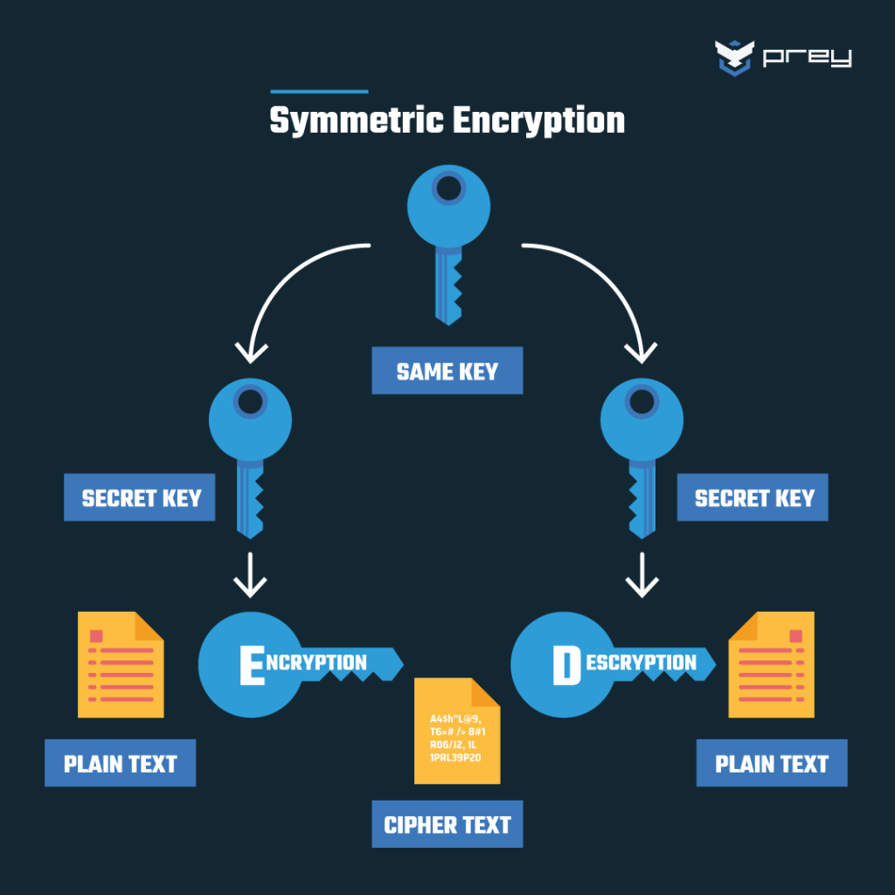
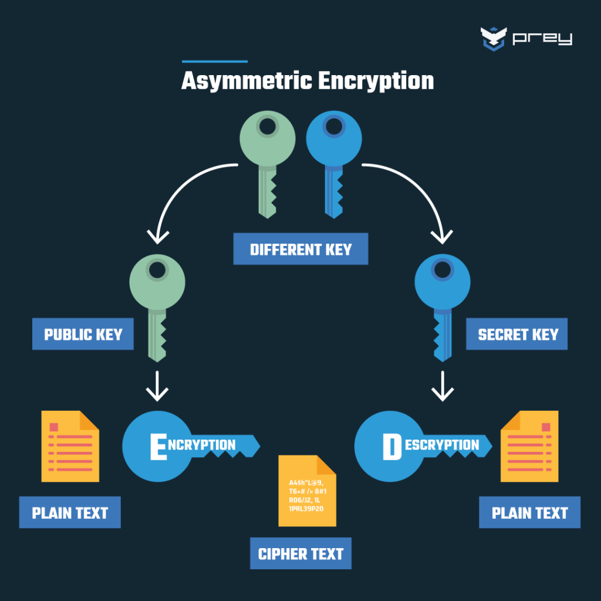

# Symmetric Key(대칭키) vs Asymmetric Key(비대칭키)

    
    

## 암호화

데이터를 암호화하는 여러가지 방법 중 하나는 특정한 정보를 다른 사람들은 보지 못하도록 특정 키를 가지고 **정보를 잠그는 것(암호화)**입니다.
이 방법을 사용하면 우리가 원하는 특정한 사용자에게 위에서 사용한 키를 알려주고, 사용자가 그 키를 이용해 **잠긴 정보를 풀어서(복호화)** 확인할 수 있습니다.
암호와와 복화화를 할 때 사용한 키가 똑같은 방식을 대칭키, 다른 방식을 비대칭키(공개키)라고 합니다.

## 대칭키(Symmetric Key) 암호화 방식

- 동일한 키를 사용하기 때문에 공개키 암호화 방식보다 빠릅니다.
- 불순한 의도를 가진 사용자에게 암호화된 정보와 암호화에 사용된 키를 지키기 어렵습니다.

## 비대칭키(Asymmetric Key) / 공개키(Public Key) 암호화 방식

- 두개의 개별 암호화 대칭키(공개키와 개인키)를 사용합니다.
- 공개키(Public Key)는 모든 사람에게 공개할 수 있는 키로 데이터를 암호화하는데 사용합니다.
- 개인키(Private Key)는 사용자만이 가지고 있어야 하는 키로 데이터를 복호화하는데 사용합니다.
- 공개키로 암호화된 정보는 공캐키로 복호화 될 수 없고, 개인키로만 복호화 될 수 있습니다.
- 이메일 암호화, 전자상거래, 온라인 뱅킹 등 안전한 인터넷 통신에 자주 사용됩니다.

## 둘 중 누구를 써야할까?

대칭키 암호화는 효율적이고 빠른 처리를 가능하게 하지만, 키 교환의 복잡성과 보안 문제가 있고 비대칭키 암호화는 보안성이 높지만 처리 속도가 느립니다.
이 두 방식은 서로 보완적으로 작용하여, 종종 함께 사용되기도 하는데 대표적인 예로 SSL(HTTPS)이 있습니다.
아래는 SSL 이 두 암호화 방식을 사용하는 방법입니다. SSL은 전송되는 데이터는 암호화되어 있지만, 암호화 키 자체는 전송되지 않습니다.

    1. 클라이언트가 보안 페이지에 접속할 때, HTTPS를 사용하여 접속합니다.
    2. 서버는 클라이언트에게 공개 키와 인증서를 보냅니다.
    3. 클라이언트는 인증서가 신뢰할 수 있는 당사자(일반적으로 신뢰할 수 있는 인증 기관)에서 발급되었는지, 인증서가 여전히 유효한지, 인증서가 연결된 사이트와 관련되어 있는지 확인합니다.
    4. 클라이언트는 공개 키를 사용하여 임의의 생성한 대칭 암호화 키를 암호화하고 이를 필요한 암호화된 URL 및 기타 암호화된 HTTP 데이터와 함께 서버에 보냅니다.
    5. 서버는 자신의 개인 키를 사용하여 대칭 암호화 키를 해독하고 대칭 키를 사용하여 URL 및 HTTP 데이터를 해독합니다.
    6. 서버는 요청된 HTML 문서와 대칭 키로 암호화된 HTTP 데이터를 다시 보냅니다.
    7. 클라이언트는 대칭 키를 사용하여 HTTP 데이터와 HTML 문서를 해독하고 정보를 표시합니다.

---

> 참고

- https://www.geeksforgeeks.org/public-key-encryption/?ref=lbp
- https://www.ibm.com/docs/en/rbd/9.5.1?topic=ssl-how-works
- [이미지 출처](https://preyproject.com/blog/types-of-encryption-symmetric-or-asymmetric-rsa-or-aes)
