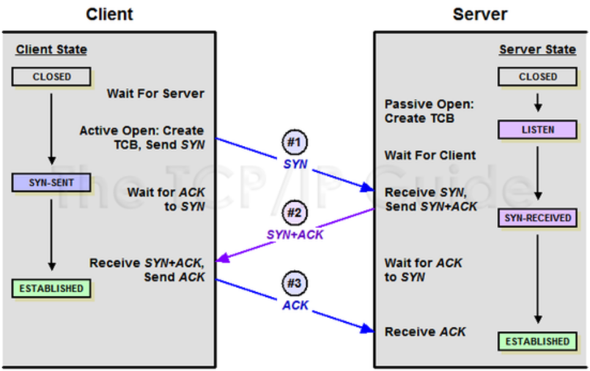
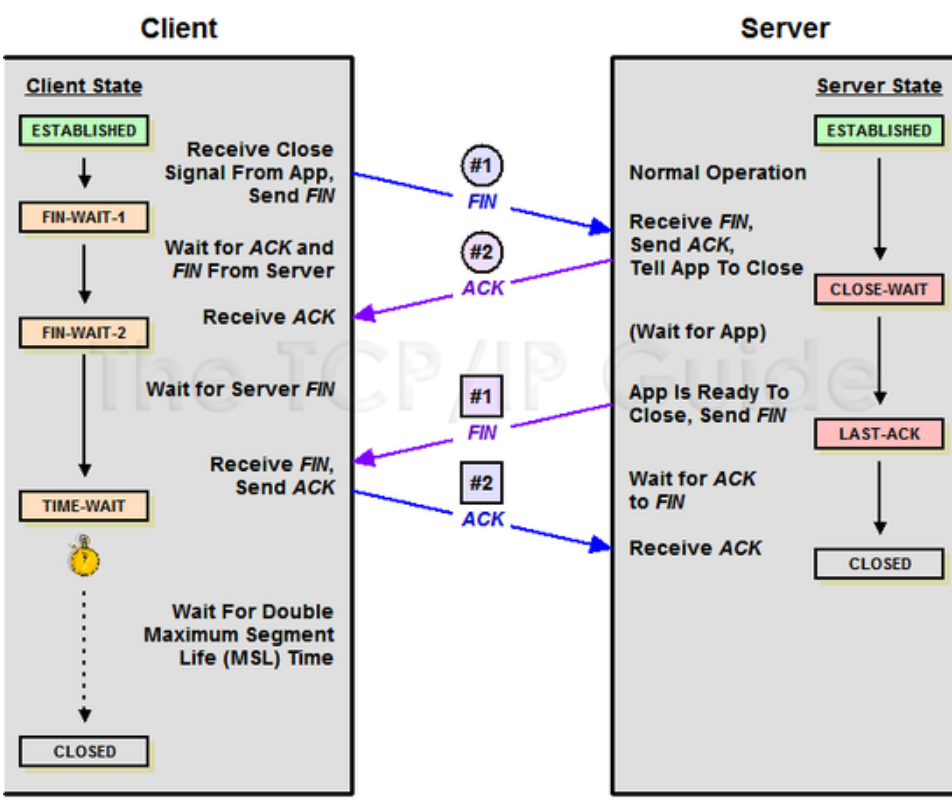

# TCP 3-way-handshake & 4-way-handshake

## 포트(PORT) 상태 정보

- CLOSED : 포트가 닫힌 상태
- LISTEN : 포트가 열린 상태로 연결 요청 대기 중
- SYN_RCV : 요청을 받고 상대방의 응답을 기다리는 중
- ESTABLISHED : 포트 연결 상태
- TIME-WAIT : 서버로부터 FIN을 수신하더라도 일정시간(default: 240초)동안 세션을 남겨놓고 잉여 패킷을 기다리는 과정

## Flag 정보

- TCP Header에는 CONTROL BIT(플래그 비트, 6bit)가 존재하며, 각각의 bit는 “URG-ACK-PSH-RST-SYN-FIN”의 의미를 가짐 → 해당 위치의 bit가 1이면 해당 패킷이 어떠한 내용을 담고 있는 패킷인지를 나타냄
- SYN(Synchronize Sequence Number)
  - 연결 설정
  - 접속 요청을 할 때 보내는 패킷
  - Sequence Number를 랜덤으로 설정하여 세션을 연결하는데 사용하며, 초기에 Sequence Number를 전송함
  - Connection을 생성할 때 사용하는 flag
  - TCP 접속 시에 가장 먼저 보내는 패킷
- ACK(Acknowledgement)
  - 응답 확인
  - 패킷을 받았다는 것을 의미
  - Acknowledgement Number 필드가 유효한지를 나타냄
  - 양단 프로세스가 쉬지 않고 데이터를 전송한다고 가정하면 최초 연결 설정 과정에서 전송되는 첫 번째 세그먼트를 제외한 모든 세그먼트의 ACK 비트는 1로 지정된다고 생각할 수 있음
- PSH
  - 데이터를 즉시 목적지로 보내라는 의미
- FIN(Finish)
  - 연결 해제
  - 세션 연결을 종료시킬 때 사용되며, 더 이상 전송할 데이터가 없음을 의미
  - 4-way-handshake에서 사용

## TCP 3-way-handshake (TCP 연결 성립 과정)

    

- 통신을 시작할 때
- TCP/IP 프로토콜을 이용해서 통신을 하는 응용프로그램이 데이터를 전송하기 전에 먼저 정확한 전송을 보장하기 위해 상대방 컴퓨터와 사전에 세션을 수립하는 과정
- 양쪽 모두 데이터를 전송할 준비가 되어있다는 것을 보장하고 실제로 데이터 전달이 시작하기 전에 다른 한쪽이 준비되었다는 것을 알 수 있도록 해줌

1. 클라이언트 → 서버 : SYN

   - 클라이언트가 서버에게 접속을 요청하는 SYN플래그를 보냄

   - 클라이언트는 서버에 클라이언트 ISN을 담아 SYN을 보냄

   - (ISN : 새로운 TCP 연결의 첫 번째 패킷에 할당된 임의의 시퀀스 번호, 장치마다 다를 수 있음)

2. 서버 → 클라이언트 : SYN + ACK

   - 서버는 Listen 상태에서 SYN이 들어온 것을 확인하고 SYN_RECV 상태로 바뀌어 SYN + ACK 플래그를 클라이언트에게 전송함

   - 그 후 서버는 다시 ACK 플래그를 받기 위해 대기상태로 변경됨

   - 서버는 클라이언트의 SYN을 수신하고 ISN을 보내며 승인번호로 클라이언트의 ISN+1을 보냄

3. 클라이언트 → 서버 : ACK

   - SYN + ACK 상태를 확인한 클라이언트는 서버에게 ACK를 보내고 연결 성립(ESTABLISHED 상태)이 됨

   - 클라이언트는 서버의 ISN+1 한 값인 승인번호를 담아 ACK를 서버에 보냄

## TCP 4-way-handshake (TCP 연결 해제 과정)

    

- 통신을 마칠 때
- 세션을 종료하기 위해 수행되는 절차

1. 클라이언트 → 서버 : FIN

   - 클라이언트가 연결을 종료하겠다는 FIN 플래그를 전송한 후 FIN-WAIT-1 상태로 변하고 서버의 응답을 기다림

2. 서버 → 클라이언트 : ACK

   - FIN 플래그를 받은 서버는 확인 메시지인 ACK승인 세그먼트를 클라이언트에게 보내줌

   - 그 후 CLOSE-WAIT 상태로 변함

   - 클라이언트도 마찬가지로 서버에서 종료될 준비가 됐다는 FIN을 받기 위해 FIN-WAIT-2 상태가 됨

3. 서버 → 클라이언트 : FIN

   - CLOSE 준비가 다 된 후 서버는 클라이언트에게 FIN 플래그를 전송함

4. 클라이언트 → 서버 : ACK

   - 클라이언트는 해지 준비가 되었다는 정상응답인 ACK를 서버에게 보내줌

   - 이때, 클라이언트는 TIME-WAIT 상태로 변경됨

   - 이후 모든 것이 끝나면 CLOSED 상태로 변환됨

   - (TIME-WAIT 상태는 의도치 않은 에러로 인해 연결이 데드락으로 빠지는 것을 방지하기 위해 변경 되는 것 → 만약 에러로 인해 종료가 지연되다가 타임이 초과되면 CLOSED 상태로 변경됨)

---

> 참고

- https://inpa.tistory.com/entry/NW-%F0%9F%8C%90-%EC%95%84%EC%A7%81%EB%8F%84-%EB%AA%A8%ED%98%B8%ED%95%9C-TCP-UDP-%EA%B0%9C%EB%85%90-%E2%9D%93-%EC%89%BD%EA%B2%8C-%EC%9D%B4%ED%95%B4%ED%95%98%EC%9E%90#%F0%9F%95%B9%EF%B8%8F_tcp%EC%9D%98_%EC%A0%84%EC%86%A1_%EC%A0%9C%EC%96%B4_%EA%B8%B0%EB%B2%95
- https://github.com/devSquad-study/2023-CS-Study/blob/main/Network/network_tcp_and_udp.md
- https://jeongkyun-it.tistory.com/180
- [이미지 출처](https://jeongkyun-it.tistory.com/180)
