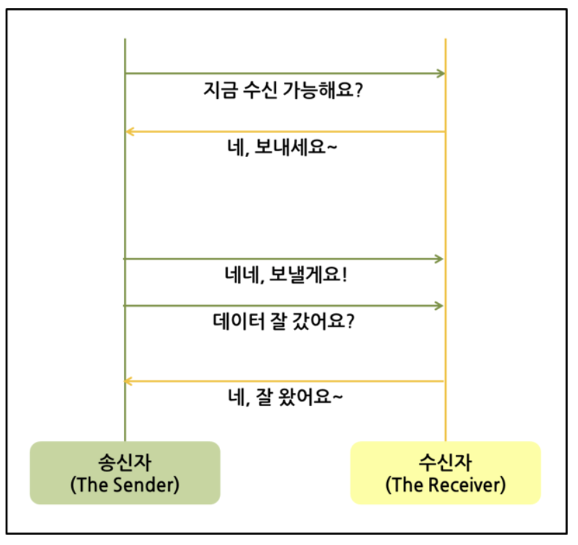
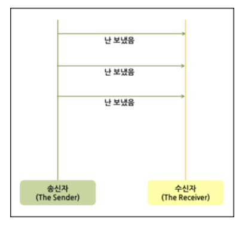

# TCP vs UDP(Transmission Control Protocol vs User Datagram Protocol)

## TCP

    

- Transmission Control Protocol의 약자
- 연결형 서비스를 지원하는 전송 계층 프로토콜
- IP 규칙으로만 통신하기에 부족하거나 불안정하던 여러 단점을 커버해, 패킷 전송을 제어하여 신뢰성을 보증하는 프로토콜
- 일반적으로 TCP와 IP를 함께 사용하는데, IP가 데이터의 배달을 처리한다면 TCP는 패킷을 추적 및 관리하게 됨
- 흐름 제어와 혼잡 제어를 지원하며 데이터의 순서를 보장함
- 신뢰성이 요구되는 애플리케이션

## UDP

    

- User Datagram Protocol의 약자
- 비연결형 서비스를 지원하는 전송계층 프로토콜
- 정보를 주고 받을 때 정보를 보내거나 받는다는 신호절차를 거치지 않고, 보내는 쪽에서 일방적으로 데이터를 전달함
- 혼잡 제어를 하지 않음
- 간단한 데이터를 빠른 속도로 전송하고자 하는 애플리케이션

## TCP와 UDP 차이점

|                  | TCP                    | UDP                                                     |
| ---------------- | ---------------------- | ------------------------------------------------------- |
| 연결 방식        | 연결형 서비스          | 비연결형 서비스                                         |
| 패킷 교환        | 가상 회선 방식         | 데이터그램 방식                                         |
| 전송 순서 보장   | 보장함                 | 보장하지 않음                                           |
| 신뢰성           | 높음                   | 낮음                                                    |
| 전송 속도        | 느림                   | 빠름                                                    |
| 데이터 경계 구분 | 구분하지 않음          | 구분함                                                  |
| 데이터 재전송    | 존재                   | 존재하지 않음                                           |
| 통신 방식        | 일 대 일(Unicast) 통신 | 일 대 일, 일 대 다(Broadcast), 다 대 다(Multicast) 통신 |

---

> 참고

- https://github.com/devSquad-study/2023-CS-Study/blob/main/Network/network_tcp_and_udp.md
- https://cocoon1787.tistory.com/757
- https://choseongho93.tistory.com/3
- https://velog.io/@hidaehyunlee/TCP-%EC%99%80-UDP-%EC%9D%98-%EC%B0%A8%EC%9D%B4
- https://inpa.tistory.com/entry/NW-%F0%9F%8C%90-%EC%95%84%EC%A7%81%EB%8F%84-%EB%AA%A8%ED%98%B8%ED%95%9C-TCP-UDP-%EA%B0%9C%EB%85%90-%E2%9D%93-%EC%89%BD%EA%B2%8C-%EC%9D%B4%ED%95%B4%ED%95%98%EC%9E%90#udp_-_%EC%82%AC%EC%9A%A9%EC%9E%90_%EB%8D%B0%EC%9D%B4%ED%84%B0%EA%B7%B8%EB%9E%A8_%ED%94%84%EB%A1%9C%ED%86%A0%EC%BD%9C
- [이미지 출처](https://velog.io/@hidaehyunlee/TCP-%EC%99%80-UDP-%EC%9D%98-%EC%B0%A8%EC%9D%B4)
