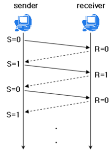
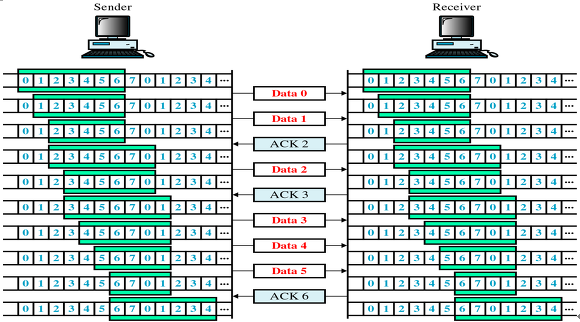
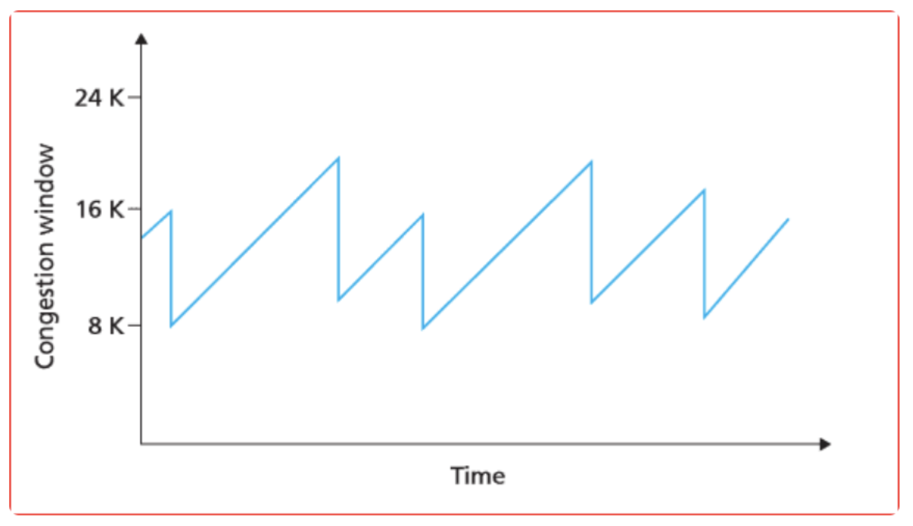
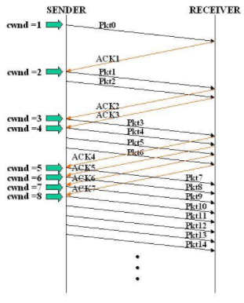

# TCP 흐름제어 & 혼잡제어(Flow control & Congestion control)

## TCP의 전송 제어 기법

- TCP는 전송 흐름을 제어하는 기능을 프로토콜 자체에 포함함
- TCP의 전송 제어 방법으로 흐름 제어와 혼잡 제어가 있음

## 흐름제어(Flow control)

- 수신 측의 처리량이 송신 측의 전송량보다 적은 경우, 패신이 수신 측의 큐를 넘어 손실될 수 있어서 송신 측 패킷 전송량을 제어해줘야 함
- 송신 측과 수신 측의 TCP 버퍼 크기 차이로 인해 생기는 데이터 처리 속도 차이를 해결하기 위한 기법
- (TCP 버퍼 : 송신 측은 버퍼에 TCP 세그먼트를 보관한 후 순차적으로 전송하고, 수신 측은 도착한 TCP 세그먼트를 애플리케이션이 읽을 때까지 버퍼에 보관함)
- 흐름제어 두 가지 방식

  1. Stop and Wait (정지-대기)

    

      
    

       - 매번 전송한 패킷에 대해 확인 응답(ACK)을 받아야만 그 다음 패킷을 전송하는 방법

  2. Sliding Window (슬라이딩 윈도우)

    

      
    

  - 수신 측에서 설정한 윈도우(수신, 송신 스테이션 양쪽에서 만들어진 버퍼 크기) 크기만큼 송신 측에서 확인 응답(ACK) 없이 패킷을 전송할 수 있게 하여 데이터 흐름을 동적으로 조절하는 제어 기법

  - 송신 측은 ACK 라는 프레임을 받게 되면 ACK 프레임에 다른 프레임의 수 만큼 오른쪽으로 경계가 확장됨

## 혼잡제어(Congestion control)

- 네트워크가 불안정하여 데이터가 원활히 통신이 안되면 제어를 통해 재전송을 하게 되는데, 재전송 작업이 반복되면 네트워크가 붕괴될 수도 있음
- 네트워크 혼잡을 피하기 위해 송신 측에서 보내는 데이터의 전송 속도를 제어하는 것
- 송신 측 데이터 전달과 네트워크 데이터 처리 속도 차이를 해결하기 위한 방법
- TCP 혼잡제어 알고리즘

  1. AIMD (Additive Increase/Multicative Decrease)

    

      
    

  - 합 증가/곱 감소 방식

  - 처음에 패킷을 하나씩 보내고 문제 없이 도착하면 윈도우의 크기를 1씩 증가시켜가며 전송함

  - 만약, 전송에 실패하면 윈도우 크기를 반으로 줄임

  2. Slow Start (슬로 스타트)

    

      
    

  - 패킷을 하나씩 보내면서 시작하고, 패킷이 문제없이 도착하면 각각의 ACK 패킷마다 window size를 1씩 늘려줌

  - 즉, 한 주기가 지나면 window size가 2배로 됨

  3. Congestion Avoidance (혼잡 회피)

     - 윈도우 크기가 임계 값에 도달한 이후에는 데이터의 손실이 발생할 크기가 올라감

     - 이를 회피하기 위해 window size를 전송 시마다 1 씩 증가시킴

     - 수신 측으로부터 일정 시간동안 ACK 를 받지 못하면, 타임 아웃이 발생해 window size를 1로 줄임

     - 동시에 임계 값을 패킷 손실이 발생했을 때의 window size의 1/2로 줄인다.

  4. Fast Recovery (빠른 회복)

     - 혼잡한 상태가 되면 window size를 1이 아니라 절반으로 줄이고 선형 증가 시키는 방법

     - 빠른 회복 정책이 적용되면 이후엔 순수한 AIMD 방식으로 동작

  5. Fast Retransmit (빠른 재전송)

     - 중복된 순번의 패킷을 3개 받으면 재전송함

     - 재전송하는 경우 혼잡 상태로 간주하고 혼잡 회피를 함

- 혼잡 제어 정책
  - TCP에는 Tahoe, Reno, New Reno, Cubic, Ealstic-TCP까지 다양한 혼잡 제어 정책 존재
  - 공통적으로 혼잡이 발생하면 윈도우 크기를 줄이거나, 혹은 증가시키지 않으며 혼잡을 회피한다라는 전제를 깔고 있음

---

> 참고

- https://github.com/gyoogle/tech-interview-for-developer/blob/master/Computer%20Science/Network/TCP%20(%ED%9D%90%EB%A6%84%EC%A0%9C%EC%96%B4%ED%98%BC%EC%9E%A1%EC%A0%9C%EC%96%B4).md
- https://inpa.tistory.com/entry/NW-%F0%9F%8C%90-%EC%95%84%EC%A7%81%EB%8F%84-%EB%AA%A8%ED%98%B8%ED%95%9C-TCP-UDP-%EA%B0%9C%EB%85%90-%E2%9D%93-%EC%89%BD%EA%B2%8C-%EC%9D%B4%ED%95%B4%ED%95%98%EC%9E%90#%F0%9F%A4%9D_3-way_handshake_%EA%B3%BC%EC%A0%95-1
- https://www.brianstorti.com/tcp-flow-control/
- https://steady-coding.tistory.com/507
- https://velog.io/@chullll/%ED%9D%90%EB%A6%84%EC%A0%9C%EC%96%B4-%ED%98%BC%EC%9E%A1%EC%A0%9C%EC%96%B4
- [이미지 출처](https://velog.io/@chullll/%ED%9D%90%EB%A6%84%EC%A0%9C%EC%96%B4-%ED%98%BC%EC%9E%A1%EC%A0%9C%EC%96%B4)
