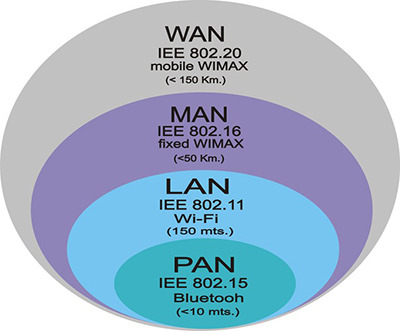

# 네트워크란?

## 네트워크 정의

- Net과 Work의 합성어
- 노드와 링크가 서로 연결되어 있으며 리소스를 공유하는 집합
- 데이터와 리소스를 전송, 교환 또는 공유할 목적으로 케이블(유선) 또는 WiFi(무선)를 통해 연결된 두 대 이상의 컴퓨터로 구성
- IEEE에서는 "몇 개의 독립적인 장치가 적절한 영역 내에서 적당히 빠른 속도로 물리적 통신 채널을 통하여 서로가 직접 통신할 수 있도록 지원해주는 데이터 통신 체계"라고 네트워크를 정의하였음

## 중요 용어

- ip주소
  : 인터넷 프로토콜을 사용하여 통신하는 네트워크에 연결된 모든 디바이스에 할당된 고유 번호
  : 디바이스의 호스트 네트워크 및 호스트 네트워크에서 디바이스의 위치를 식별
- 노드
  : 데이터를 수신, 전송, 생성 또는 저장할 수 있는 네트워크 내부의 연결 지점
  : 정보를 인식하고 처리하며 다른 네트워크 노드로 전송할 수 있는 네트워크 디바이스
  : (예) 컴퓨터, 프린터, 모뎀, 브리지 및 스위치 등
- 라우터
  : 네트워크 간에 데이터 패킷에 포함된 정보를 전송하는 물리적 또는 가상 디바이스
  : 라우팅을 하는 장비
  : 서로 다른 네트워크 간의 통신을 용이하게 하는 가상 또는 물리적 디바이스
  : 다른 네트워크에 존재하는 장치끼리 서로 데이터를 주고받을 때 패킷 소모를 최소화하고 경로를 최적화하여 최소 경로로 패킷을 포워딩하는 장비
- 라우팅
  : 네트워크에서 경로를 선택하는 프로세스
  : IP주소를 찾아가는 과정
- 스위치
  : 다른 디바이스를 연결하고 네트워크 내에서 노드 간 통신을 관리하여 데이터 패킷이 최종 목적지에 도달할 수 있도록 하는 디바이스
  : 라우터가 네트워크 간에 정보를 전송하는 동안 단일 네트워크의 노드 간에 정보를 전송
- 스위칭
  : 네트워크의 디바이스 간에 데이터가 전송되는 방식(회선 스위칭, 패킷 스위칭, 메시지 스위칭)
- 포트
  : 네트워크 디바이스 간의 특정한 연결을 번호로 식별
- 프로토콜
  : 통신을 주고받는 방식을 정의함
- 처리량
  : 링크 내에서 성공적으로 전달된 데이터의 양
- 지연 시간
  : 요청이 처리되는 시간 → 어떤 메시지가 두 장치 사이를 왕복하는데 걸린 시간

## 네트워크의 분류

    

- PAN
  : 개인 네트워크로 한 사람에게 서비스를 제공
- LAN
  : 로컬 영역 네트워크로 비교적 짧은 거리에서 컴퓨터를 연결하여 데이터, 파일 및 리소스를 공유할 수 있도록 함
  : 사무실과 개인적으로 소유 가능한 규모
  : 근거리 통신망으로 전송 속도가 빠르고 혼잡하지 않음
  : 개인이 소유하고 관리
  : (예) 사무실 건물, 학교 또는 병원 내의 모든 컴퓨터를 연결
- MAN
  : 대도시 지역 네트워크로 도시 같은 넓은 지역에서 운영
  : 전송 속도는 평균이며 LAN보다는 더 많이 혼잡
  : 도시와 정부 기관에서 소유하고 관리
- WAN
  : 광역 네트워크로 지역 간 또는 대륙 간 등 넓은 지역의 컴퓨터를 연결
  : 집합적 또는 분산적 소유권 모델로 관리
  : 전송 속도는 낮으며 MAN보다 더 혼잡

## 작동 방법

- 컴퓨터 네트워크는 케이블, 광섬유 또는 무선 신호를 사용하여 컴퓨터, 라우터 및 스위치와 같은 노드를 연결
- 이러한 연결을 통해 네트워크의 디바이스는 정보와 리소스를 통신하고 공유할 수 있음

## 좋은 네트워크

많은 처리량을 처리할 수 있으며 지연 시간이 짧고 장애 빈도가 적으며 좋은 보안을 갖춘 네트워크

## 네트워크 통신 방식

- 유니캐스트 : 고유 주소로 식별된 하나의 네트워크 목적지에 1:1로 데이터를 전송하는 방식
- 멀티캐스트 : 네트워크에 다수의 대상이 있을 때, 그 중 특정 대상들이랑만 1:N 통신하는 방식
- 브로드캐스트 : 송신 호스트가 전송한 데이터가 네트워크에 연결된 모든 호스트에 전송되는 방식

---

> 참고

- https://www.ibm.com/kr-ko/topics/networking
- https://cocoon1787.tistory.com/704
- [이미지 출처](https://cocoon1787.tistory.com/704)
