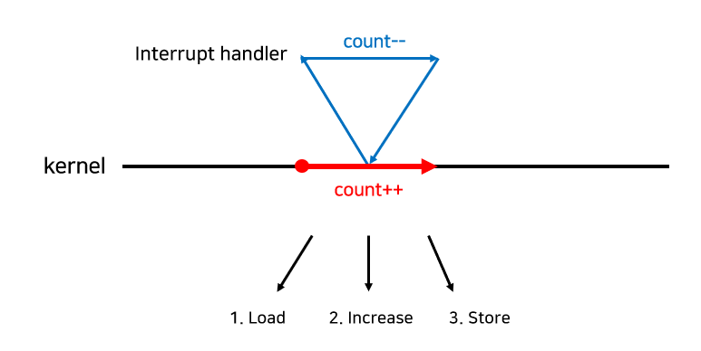

# 동기화 문제

## 동기화 문제

- 멀티 스레드가 프로세스 내의 같은 자원을 공유함으로써 발생하게 됨 → 동시에 공유 자원에 접근하는 것은 데이터의 일관성을 해칠 수 있음
- 동기화 : 프로세스들의 실행 순서를 정하여 공유 자원의 일관성을 보장하는 것

## 경쟁 상태(Race Condition)

- 여러 프로세스들이 공유 자원에 동시에 접근하려고 하는 상황
- 어떤 프로세스가 마지막으로 데이터에 접근했는지에 따라 데이터의 상태가 달라지게 됨 → 데이터의 일관성 보장 X
- 이 문제를 해결하기 위해 프로세스들은 동기화되어야 함
- 발생할 수 있는 경우

1. 커널 모드로 수행 중 인터럽트가 발생하는 경우

    

2. 프로세스가 시스템 콜을 호출해서 커널 모드로 수행 중인데 context switch가 발생하는 경우

    

3. 멀티 프로세서에서 공유 메모리 내의 커널 데이터에 접근하는 경우

    

## 임계 구역(Critical Section)

- 공유 자원이 접근되는 부분
- 만약 어떤 프로세스가 임계영역의 작업을 수행중이라면 다른 프로세스는 해당 임계 영역에 들어와서는 안됨
- 3가지 조건

1. 상호배제
   : 프로세스 P가 해당 임계 영역을 수행 중이라면, 다른 프로세스들은 해당 임계영역을 수행 해서는 안됨
2. 진행
   : 아무도 임계 영역에 없는데 프로세스가 임계 영역에 못 들어가면 안됨
3. 한정 대기
   : Critical Section에 진입하려는 프로세스가 무한정 기다려서는 안됨

## 고전적인 동기화 문제

1. Producer-Consumer Problem (Bounded-Buffer Problem)
2. Readers-Writers Problem
3. Dining-Philosophers Problem

## 동기화를 위한 하드웨어적 해결방법

- Lock(락)

## 동기화를 위한 소프트웨어적 해결방법

- Semaphore(세마포어)

## 동기화로 인해 발생하는 문제

1. 교착상태(Deadlock)
   : 두 개 이상의 프로세스가 어떤 사건을 기다리고 있는데, 같이 기다리는 프로세스 중 하나만이 그 사건을 발생시킬 수 있는 상황
2. 기아 – Infinite Blocking(무한대기)
   : 프로세스가 Semaphore Queue에서 무한히 대기하는 상황
3. 우선순위 역전(Priority Inversion)
   : 공유 자원에 대한 허가를 기다리는 동안 낮은 우선순위의 프로세스와 스케줄링 순서가 뒤바뀌는 상황

---

> 참고

- https://velog.io/@wonseok97/%EC%8A%A4%EB%A0%88%EB%93%9C%EC%9D%98-%EB%8F%99%EA%B8%B0%ED%99%94-%EB%AC%B8%EC%A0%9C%EC%99%80-%ED%95%B4%EA%B2%B0%EB%B2%95
- https://velog.io/@guswns3371/%EC%9A%B4%EC%98%81%EC%B2%B4%EC%A0%9C-%EB%8F%99%EA%B8%B0%ED%99%94-%EB%AC%B8%EC%A0%9C%EC%9D%98-%ED%95%B4%EA%B2%B0%EC%B1%85
- https://code-lab1.tistory.com/50#google_vignette
- https://rebro.kr/176
- [이미지 출처](https://rebro.kr/176)
- [이미지 출처](https://rebro.kr/176)
- [이미지 출처](https://rebro.kr/176)
