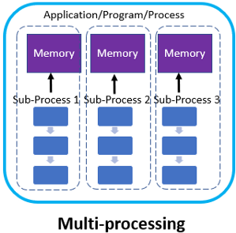
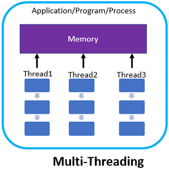

# 멀티프로세스와 멀티스레드(Multi Process & Multi Thread)

## 멀티 프로세스

    

- 운영체제에서 하나의 응용 프로그램에 대해 동시에 여러 개의 프로세스를 실행할 수 있게 하는 기술
- 하나의 부모 프로세스가 여러 개의 자식 프로세스를 생성함으로서 다중 프로세스를 구성하는 구조
  - 부모 프로세스 : 다른 프로세스를 생성하는 프로세스
  - 자식 프로세스 : 다른 프로세스에 의해 생성된 프로세스
- 각 프로세스 간 메모리 구분이 필요하거나 독립된 주소 공간을 가져야 할 경우 사용함
- 웹 브라우저에서의 여러 탭이나 여러 창
- 장점
  - 프로그램 안전성
    : 각 프로세스가 독립적인 메모리 공간을 가지므로, 한 프로세스가 비정상적으로 종료되어도 다른 프로세스에 영향을 주지 않음
    → 자식 프로세스가 여러 개 생성되어 메모리에 별도로 관리되기 때문
  - 시스템 확장성
    : 각 프로세스가 독립적이므로, 새로운 기능이나 모듈을 추가하거나 수정할 때 다른 프로세스에 영향을 주지 않아 시스템의 규모를 쉽게 확장할 수 있음
    → 하나의 성능 좋은 컴퓨터에 여러 개의 서버 프로세스를 둠
    → ex 분산 서버 : 여러 대의 서버에 요청을 분산시켜 처리함으로써, 시스템의 규모를 쉽게 확장할 수 있으며, 부가로 서버의 장애나 다운타임을 최소화할 수 있게 되는 것
- 단점
  - context switching overhead
    : 컨텍스트 스위칭(멀티 태스킹을 구성하는데 핵심 기술) 과정에서 성능 저하가 올 수 있음
    → CPU는 다음 프로세스의 정보를 불러오기 위해 메모리를 검색하고, CPU 캐시 메모리를 초기화하며, 프로세스 상태를 저장하고, 불러올 데이터를 준비해야하기 때문에 빈번한 context switching 작업이 발생함 → 작업량이 많을수록 비용 오버헤드가 발생할 수 있음
  - 자원 공유 비효율성
    : 독립적인 메모리 공간을 가져 메모리 사용량이 증가하게 됨
    → 각 프로세스 간에 자원 공유가 필요할 경우 프로세스 사이의 어렵고 복잡한 통신 기법인 IPC를 사용하여야 하는데 IPC 자체로 오버헤드가 발생하고 코드의 복잡도를 증가시킴
    (IPC : 운영체제 상에서 실행 중인 프로세스 간에 정보를 주고받는 메커니즘)

## 멀티 스레드

    

- 하나의 프로세스 안에 여러 개의 스레드 있는 것
- 하나의 프로그램에서 두 가지 이상의 동작을 동시에 처리하도록 하는 행위
  → 사용자가 서버 데이터베이스에 자료를 요청하는 동안 브라우저의 다른 기능을 이용할 수 있는 이유
  → 하나의 스레드가 지연되더라도, 다른 스레드는 작업을 지속할 수 있게 됨
- 웹 브라우저의 단일 탭 또는 창 내에서 브라우저 이벤트 루프, 네트워크 처리, I/O 및 기타 작업을 관리하고 처리
- 장점
  - 스레드는 프로세스보다 가벼움
    : 스레드는 프레스와 달리, 코드, 데이터, 스택 영역을 제외한 나머지 자원을 서로 공유하기 때문에 기본적으로 내장되어 있는 데이터 용량이 프로세스보다 당연히 작음
  - 자원의 효율성
    : 프로세스 간 통신(IPC)을 사용하지 않고도 데이터를 공유할 수 있기 때문에 시스템 자원 소모가 줄어듦
  - context switching 비용 감소
    : 스레드에도 컨텍스트 스위칭 오버헤드가 존재하지만, 상대적으로 프로세스 컨텍스트 스위칭 오버헤드보다 훨씬 낮음
  - 응답 시간 단축
    : 스레드 간의 통신이나 자원 공유가 더욱 용이하며, 프로세스 보다 가벼워 컨텍스트 스위칭 오버헤드도 작기 때문임
- 단점
  - 안정성 문제
    : 멀티 스레드는 하나의 스레드에서 문제가 발생하면 다른 스레드들도 영향을 전체 프로그램이 종료될 수 있음
  - 동기화로 인한 성능 저하
    : 동기화 작업이 여러 스레드 접근을 제한하는 것이기 때문에 병목 현상이 일어나 성능이 저하될 가능성이 높음
  - 데드락(교착 상태)
    : 공유 자원에 대한 동시 엑세스로 인한 문제
  - context switching overhead
    : 멀티 프로세스보다 컨텍스트 스위칭 오버헤드가 작지만 비용 자체를 무시할 수는 없음
  - 디비깅이 어려움
    : 코드를 디버깅하는 도중에 다른 스레드가 실행되어 예기치 않은 결과가 발생할 수 있음

## 멀티 프로세스 대신 멀티 스레드를 사용하는 이유

- 자원 효율성 증대
  → 프로세스 생성 시 자원을 할당하는 시스템 콜이 줄어들어 자원 소모가 적고 자원을 효율적으로 관리할 수 있음
- 처리 비용 감소
  → 프로세스의 경우 프로세스 간의 통신을 위해서는 IPC를 통해서 통신을 해야 하지만, 스레드의 경우 스레드 간의 자원 공유가 간단하기 때문에 시스템 자원 소모가 작음
- 응답 시간 단축
  → 프로세스의 경우 Context Switching 시 CPU 레지스터, RAM과 CPU 사이의 캐시 메모리가 초기화되기 때문에 오버헤드가 큰 반면, 스레드는 Context Switching시 Stack영역만 처리하면 되므로 스레드 간의 문맥 교환 속도가 빠름
  ※ 주의사항 : 전역 변수를 통해 스레드 간의 자원을 공유하기 때문에 동기화 문제는 잘 해결해야 함

## 웹 서버의 멀티 프로세스/스레드 여부 (톰캣과 아파치의 구조)

Apache

- 아파치 소프트웨어 재단에서 만든 웹 서버
- 정적인 데이터를 처리하는 웹 서버
- 멀티 프로세스로 구현되어 있으나 설정에 따라 멀티 스레드를 같이 운용할 수 있음
  → 멀티 프로세스 내에는 기본적으로 메인 스레드가 존재하고, 멀티 스레드로 확장할 수 있음

Tomcat

- 웹 서버와 웹 컨테이너의 결합
- 현재 가장 일반적이고 많이 사용되는 WAS(웹 애플리케이션 서버)
- 요청을 처리하기 위한 스레드 풀을 관리하고 있음
- 요청이 오면 해당 스레드 풀에서 스레드를 꺼내 요청을 처리하도록 함

---

> 참고

- https://velog.io/@whddlrs/50%EB%AC%B8-50%EB%8B%B5-9%EC%95%84%ED%8C%8C%EC%B9%98-%ED%86%B0%EC%BA%A3%EC%9D%80-%EA%B0%81%EA%B0%81-%EB%A9%80%ED%8B%B0-%ED%94%84%EB%A1%9C%EC%84%B8%EC%8A%A4%EC%9D%B8%EA%B0%80-%EB%A9%80%ED%8B%B0-%EC%93%B0%EB%A0%88%EB%93%9C%EC%9D%B8%EA%B0%80
- https://inpa.tistory.com/entry/TOMCAT-%E2%9A%99%EF%B8%8F-%EC%84%A4%EC%B9%98-%EC%84%A4%EC%A0%95-%EC%A0%95%EB%A6%AC
- https://wooody92.github.io/os/%EB%A9%80%ED%8B%B0-%ED%94%84%EB%A1%9C%EC%84%B8%EC%8A%A4%EC%99%80-%EB%A9%80%ED%8B%B0-%EC%8A%A4%EB%A0%88%EB%93%9C/
- https://cocoon1787.tistory.com/688
- https://inpa.tistory.com/entry/%F0%9F%91%A9%E2%80%8D%F0%9F%92%BB-multi-process-multi-thread
- [이미지 출처](https://cocoon1787.tistory.com/688)
- [이미지 출처](https://cocoon1787.tistory.com/688)
