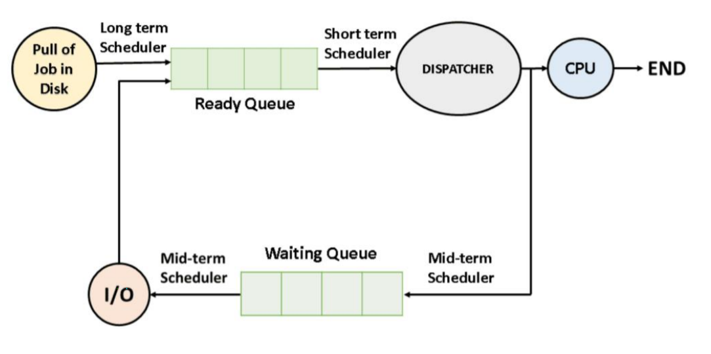

# 스케줄러의 종류(단기, 중기, 장기)

    

## 단기 스케줄러(Short Term Scheduler)

- CPU 스케줄러
- CPU와 메모리 사이를 담당하는 스케줄러
- 메모리 내의 준비 상태에 있는 작업 중 실행 할 프로세스를 선택하여 CPU를 할당
- 일반적으로 쓰이는 스케줄러
- 미리 정한 스케줄링 알고리즘에 따라 CPU를 할당할 프로세스를 선택함
- 밀리 세컨트(ms) 이하의 시간 단위로 매우 빈번하게 호출되기 때문에 수행 속도가 충분히 빨라야 함
- 상태 : 준비, 실행, 대기 상태 관리

## 중기 스케줄러(Medium Term Scheduler)

- 메모리에서 CPU를 점유하기 위해 경쟁하는 프로세스를 디스크로 보내는 스케줄러
- 메모리에 적재된 프로세스 수 관리
- 스와핑 기능을 함
  - 차후 다시 프로세스를 메모리로 불러와서 중단되었던 지점에서 실행을 재개
  - 일부 프로세스를 메모리에서 디스크로 보내고(swap-out), 시간이 흘러 메모리에 여유가 생기면 다시 적재(swap-in)함
- 다중 프로그래밍의 정도를 완화
- 상태 : 중단된 준비, 준비, 중단된 대기, 대기 상태 관리

## 장기 스케줄러(Long Term Scheduler)

- 작업 스케줄러
- 메모리와 디스크 사이를 담당하는 스케줄러
- 디스크 상의 어떤 프로세스를 준비큐에 삽입할지를 결정하는 역할
- 메모리에 동시에 올라가 있는 프로세스 수를 제어함
- 가끔 호출되기 때문에 상대적으로 속도가 느린 것이 허용됨
- 상태 : 생성 상태 관리
