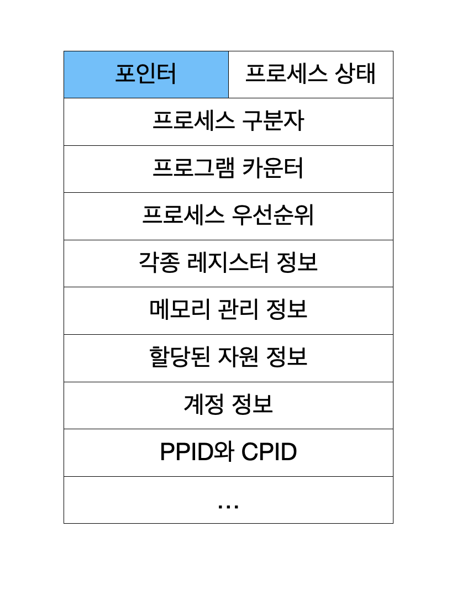

# 프로세스 제어 블록과 문맥교환(Process Control Block & Context Switching)

## 프로세스 제어 블록(PCB)

    

- 운영체제가 프로세스를 제어할 때 필요한 프로세스 상태 정보가 저장됨
- 프로세스를 실행하는데 필요한 중요한 정보를 보관하는 자료 구조
- 프로세스 생성 시에 만들어지고 실행이 끝나면 폐기됨

| 구성               | 역할                                                                 |
| ------------------ | -------------------------------------------------------------------- |
| 포인터             | PCB를 연결하여 준비 상태나 대기 상태의 큐를 구현할 때 사용           |
| 프로세스 상태      | 생성, 준비, 실행, 대기, 보류 준비, 보류 대기 등 어떤 상태인지 나타냄 |
| 프로세스 구분자    | 운영체제 내 여러 프로세스를 구별하기 위한 구분자                     |
| 프로세스 카운터    | 다음에 실행될 명령어의 위치를 가리키는 값 저장                       |
| 프로세스 우선순위  | 우선순위에 따라 PCB들이 여러 줄로 서 있음                            |
| 각종 레지트서 정보 | 다음 실행을 위해 자신이 사용하던 레지스터의 중간값을 보관            |
| 메모리 관리 정보   | 메모리 보호를 위해 경계 레지스터 값과 한계 레지스터 값 저장          |
| 할당된 자원 정보   | 프로세스 실행을 위해 입출력 자원이나 오픈 파일 등에 대한 정보        |
| 계정 정보          | 계정 정보, CPU 할당 시간, CPU 사용 시간 등                           |
| PPID와 CPID        | 부모 프로세스 구분자와 자식 프로세스 구분자 정보                     |

## 문맥교환(Context Switching)

    

- 실행 중인 프로세스의 제어를 다른 프로세스에 넘겨 실행 상태가 되도록 하는 것

1. 요청 발생 : 인터럽트 또는 트랩에 의한 요청이 발생
2. PCB에 저장 : 운영체제는 현재 실행중인 프로세스(P0)의 정보를 PCB에 저장
3. CPU 할당 : 운영체제는 다음 프로세스(P1)의 정보를 PCB에서 가져와 CPU를 할당

- 언제 발생하는가?

1. 멀티태스킹
2. 인터럽트 핸들링
3. 사용자와 커널 모드 전환

---

> 참고

- https://sommda.tistory.com/84
- https://hoyeonkim795.github.io/posts/pcb/
- https://spurdev.tistory.com/13
- [이미지 출처](https://yudeokrin.github.io/posts/2022-10-13-page57)
- [이미지 출처](https://spurdev.tistory.com/13)
