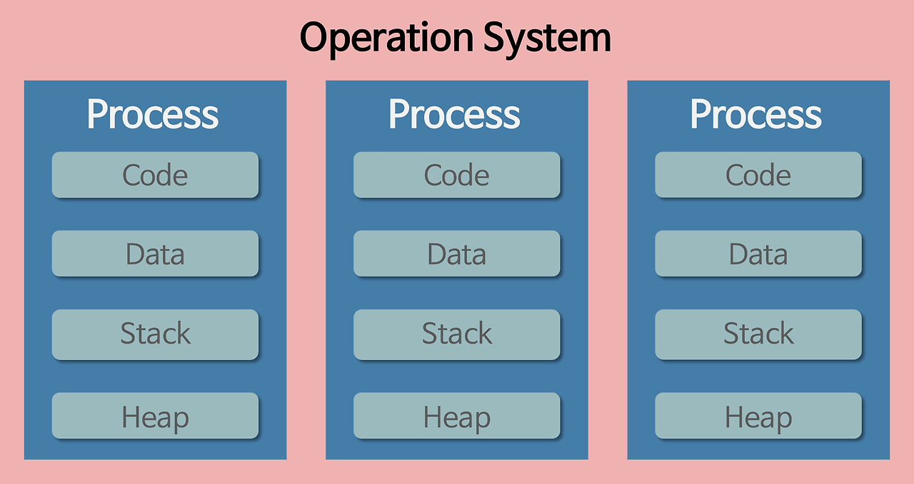
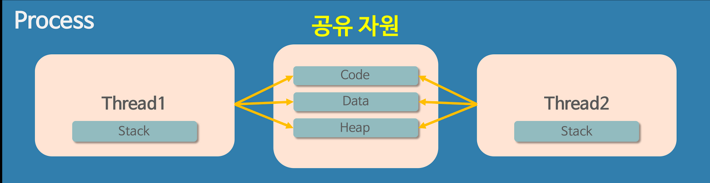

# 프로세스와 스레드(Process & Thread)

## 프로세스

    

- 프로그램을 실행시켜 정적인 프로그램이 동적으로 변하여 프로그램이 돌아가고 있는 상태
- 컴퓨터에서 작업 중인 프로그램
- 메모리에 올라와 실행되고 있는 프로그램의 인스턴스(독립적인 개체)
- 메모리에 적재되고 CPU 자원을 할당받아 프로그램이 실행되고 있는 상태
- 프로레스의 자원 구조
  - 각각 독립된 메모리 영역에 할당해 주기 때문에 다른 프로세스의 변수나 자료에 접근할 수 없음
  - 코드 영역(Code/Text) : 프로그래머가 작성한 프로그램 함수들의 코드가 CPU가 해석 가능한 기계어 형태로 저장되어 있음
  - 데이터 영역(Data) : 코드가 실행되면서 사용하는 전역 변수나 각종 데이터들이 모여있음
  - 스택 영역(Stack) : 지역 변수와 같은 호출한 함수가 종료되면 되돌아올 임시적인 자료를 저장하는 독립적인 공간이며 함수의 호출과 함께 할당되고 함수의 호출이 완료되면 소멸함
  - 힙 영역(Heap) : 동적으로 할당되는 데이터들을 위해 존재하는 공간
- 프로세스의 자원 공유 방법
  - IPC(Inter-Process Communication) 사용
  - LPC(Local Inter-Process Communication) 사용
  - 별도로 공유 메모리를 만들어서 정보를 주고받도록 설정
- 자원 부담이 큼
- 다중 작업이 필요한 경우 효율적이지 않음

## 스레드

    

- 하나의 프로세스 내에서 동시에 진행되는 작업 갈래, 흐름의 단위
- 프로세스 특성의 한계(동일한 프로그램을 여러 개의 프로세스로 만들게 되면, 그만큼 메모리를 차지하고 CPU에서 할당받는 자원이 중복되게 될 것)를 해결하기 위해 탄생함
- 하나의 프로세스가 생성되면 하나의 스레드가 생성됨
- 하나의 프로세스는 여러 개의 스레드를 가질 수 있음
- 스레드의 자원 공유
  - 메모리를 서로 공유할 수 있음
  - 프로세스의 4가지 메모리 영역(Code, Data, Heap, Stack) 중 스레드는 Stack만 할당받아 복사하고 Code, Data, Heap은 프로세스 내의 다른 스레드들과 공유
  - 자원의 생성과 관리의 중복성을 최소화하여 수행 능력을 올리기 위함

## 사용자 수준 스레드 VS 커널 수준 스레드

사용자 수준 스레드

    

- 스레드 개념을 프로그래밍 레벨에서 추상화함
- 사용자 단계에서 생성 및 관리되는 스레드
- 커널이 따로 관리하지 않고 커널이 이 스레드에 대해서 알지 못함
- 유저 스레드가 CPU에서 실행되려면 커널 스레드와 반드시 연결돼야 함

커널 수준 스레드

    

- 커널 레벨에서 생성되는 스레드
- 운영체제 시스템 내에서 생성되어 동작하는 스레드로, 커널이 직접 관리함
- CPU에서 실제로 실행되는 단위(CPU 스케줄링의 단위)

| 분류 | 사용자 수준 스레드                                      | 커널 수준 스레드                                          |
| ---- | ------------------------------------------------------- | --------------------------------------------------------- |
| 장점 | 유저 모드에서 커널 모드로의 전환이 필요없기 때문에 빠름 | 커널에서 직접 제공하기 때문에 안정성과 다양한 기능성 제공 |
| 단점 | 프로세스 단위 블록킹 발생                               | 유저 모드에서 커널 모드로의 전환이 빈번하기 때문에 느림   |

## 프로세스와 스레드의 차이점

자원 공유

| 프로세스                                                                                                                                                                                                       | 스레드                                                                                                                    |
| -------------------------------------------------------------------------------------------------------------------------------------------------------------------------------------------------------------- | ------------------------------------------------------------------------------------------------------------------------- |
| 다른 프로세스의 변수나 자료에 접근할 수 없음 → 한 프로세스를 실행하다가 오류가 발생해서 프로세스가 강제로 종료된다면 공유하고 있는 파일을 손상시키는 경우가 아니라면 다른 프로세스에게 아무런 영향을 주지 않음 | 메모리를 서로 공유할 수 있음 → 어떤 스레드 하나에서 오류가 발생한다면 같은 프로세스 내의 다른 스레드 모두가 강제로 종료됨 |

---

> 참고

- https://inpa.tistory.com/entry/%F0%9F%91%A9%E2%80%8D%F0%9F%92%BB-%ED%94%84%EB%A1%9C%EC%84%B8%EC%8A%A4-%E2%9A%94%EF%B8%8F-%EC%93%B0%EB%A0%88%EB%93%9C-%EC%B0%A8%EC%9D%B4#%ED%95%9C%EB%88%88%EC%97%90_%EC%9D%B4%ED%95%B4%ED%95%98%EB%8A%94_%ED%94%84%EB%A1%9C%EC%84%B8%EC%8A%A4__%EC%8A%A4%EB%A0%88%EB%93%9C_%EA%B0%9C%EB%85%90
- https://velog.io/@aeong98/%EC%9A%B4%EC%98%81%EC%B2%B4%EC%A0%9COS-%ED%94%84%EB%A1%9C%EC%84%B8%EC%8A%A4%EC%99%80-%EC%8A%A4%EB%A0%88%EB%93%9C
- https://cocoon1787.tistory.com/688
- https://velog.io/@chanyoung1998/%EC%8A%A4%EB%A0%88%EB%93%9C%EC%9D%98-%EC%A2%85%EB%A5%98%ED%95%98%EB%93%9C%EC%9B%A8%EC%96%B4-%EC%8A%A4%EB%A0%88%EB%93%9C-OS-%EC%8A%A4%EB%A0%88%EB%93%9C-%EC%9C%A0%EC%A0%80-%EB%A0%88%EB%B2%A8-%EC%8A%A4%EB%A0%88%EB%93%9C
  https://velog.io/@raejoonee/%ED%94%84%EB%A1%9C%EC%84%B8%EC%8A%A4%EC%99%80-%EC%8A%A4%EB%A0%88%EB%93%9C%EC%9D%98-%EC%B0%A8%EC%9D%B4
- [이미지 출처](https://velog.io/@chanyoung1998/%EC%8A%A4%EB%A0%88%EB%93%9C%EC%9D%98-%EC%A2%85%EB%A5%98%ED%95%98%EB%93%9C%EC%9B%A8%EC%96%B4-%EC%8A%A4%EB%A0%88%EB%93%9C-OS-%EC%8A%A4%EB%A0%88%EB%93%9C-%EC%9C%A0%EC%A0%80-%EB%A0%88%EB%B2%A8-%EC%8A%A4%EB%A0%88%EB%93%9C
  https://velog.io/@raejoonee/%ED%94%84%EB%A1%9C%EC%84%B8%EC%8A%A4%EC%99%80-%EC%8A%A4%EB%A0%88%EB%93%9C%EC%9D%98-%EC%B0%A8%EC%9D%B4)
- [이미지 출처](https://velog.io/@aeong98/%EC%9A%B4%EC%98%81%EC%B2%B4%EC%A0%9COS-%ED%94%84%EB%A1%9C%EC%84%B8%EC%8A%A4%EC%99%80-%EC%8A%A4%EB%A0%88%EB%93%9C)
